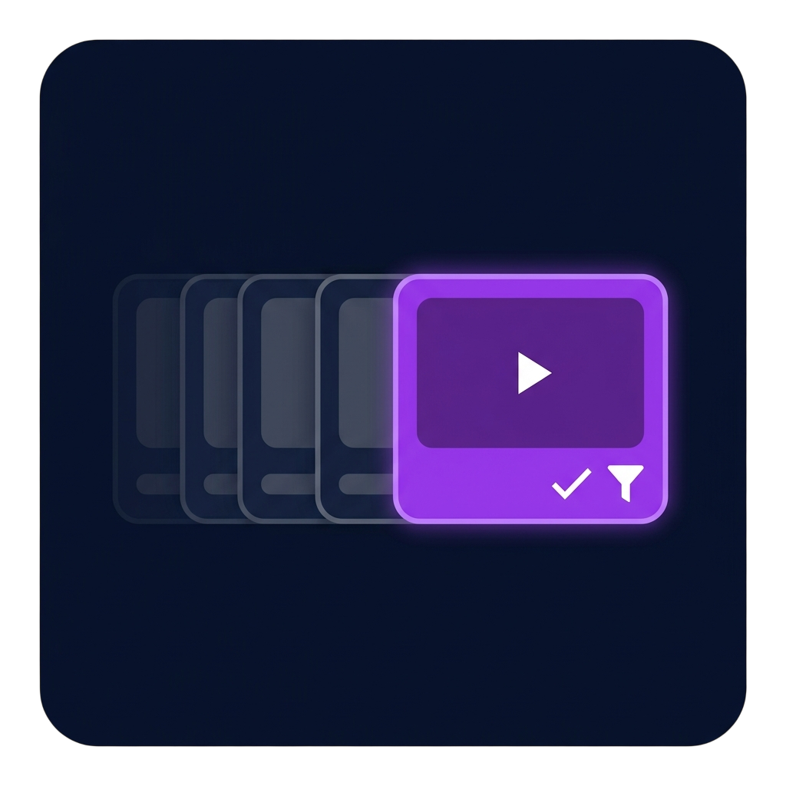

<p align="center">
  
</p>

<h1 align="center">Jellyfin Continue Watching Deduplicator</h1>

<p align="center">
  <a href="https://www.gnu.org/licenses/gpl-3.0"></a>
  <a href="https://jellyfin.org"></a>
  <a href="https://dotnet.microsoft.com/"></a>
  <a href="https://github.com/SloMR/jellyfin-plugin-dedupe-continue-watching/releases"></a>
  <a href="https://github.com/SloMR/jellyfin-plugin-dedupe-continue-watching/actions"></a>
</p>

A server-side Jellyfin plugin that deduplicates the **Continue Watching** row so each series appears only once — represented by the most recently played episode.

Works on **every Jellyfin client** (Web, Desktop, Android, iOS, Android TV, Roku, SwiftFin, Findroid, Wholphin, …) because it runs on the server, before any client receives the data.

<!-- TODO: replace with a real before/after screenshot -->
<!--  -->

## Why?

Jellyfin's native Continue Watching row shows **every episode with partial progress**. If you skipped around or paused mid-episode on multiple episodes of the same show, all of them appear, cluttering the row. This is core Jellyfin behavior, not a bug — and there's no client-side fix that works everywhere. This plugin is the proper, server-side solution.

| Before | After |
|---|---|
| Friends S9:E14, S9:E23, S10:E6, S10:E8 | Friends S10:E8 |
| HIMYM S2:E4, S3:E13, S3:E17, S4:E10 | HIMYM S4:E10 |

## Features

- **Universal** — fixes the row server-side; every client benefits, no client mods required
- **Accurate** — sorts by database `LastPlayedDate`, not progress percentage
- **Configurable** — toggle on/off, set max episodes per series, optionally dedupe movies
- **Fail-open** — if anything goes wrong, the original response passes through unchanged
- **Compression-aware** — handles gzip / brotli / deflate transparently for SDK-based clients
- **Zero external dependencies** — only `System.Text.Json`, `System.IO.Compression`, and Jellyfin packages

## Verified Clients

| Client | Endpoint | Compression | Status |
|---|---|---|---|
| Jellyfin Web (native + KefinTweaks) | `/Users/{userId}/Items/Resume` | none | ✅ |
| SwiftFin (iOS) | `/UserItems/Resume` | none | ✅ |
| Wholphin (Android TV) | `/UserItems/Resume` | gzip | ✅ |
| Findroid (jellyfin-sdk-kotlin) | `/UserItems/Resume` | gzip | ✅ |
| Any future SDK client | varies | varies | ✅ (auto-handled) |

## Installation

### Option 1 — Add the Plugin Repository (recommended)

1. In Jellyfin: **Dashboard → Plugins → Repositories → +**
2. Paste this URL:
   ```
   https://raw.githubusercontent.com/SloMR/jellyfin-plugin-dedupe-continue-watching/main/manifest.json
   ```
3. Go to **Plugins → Catalog**, find **Continue Watching Deduplicator**, install.
4. Restart Jellyfin.

### Option 2 — Manual install

1. Download the latest `.zip` from [Releases](https://github.com/SloMR/jellyfin-plugin-dedupe-continue-watching/releases).
2. Extract into your Jellyfin `plugins` directory:
   - **Linux:** `/var/lib/jellyfin/plugins/Jellyfin.Plugin.ContinueWatchingDedup_<version>/`
   - **Docker:** `/config/plugins/Jellyfin.Plugin.ContinueWatchingDedup_<version>/`
   - **Windows:** `%ProgramData%\Jellyfin\Server\plugins\Jellyfin.Plugin.ContinueWatchingDedup_<version>\`
3. Restart Jellyfin.

## Configuration

Find it under **Dashboard → Plugins → Continue Watching Deduplicator**.

| Setting | Default | Description |
|---|---|---|
| Enabled | `true` | Master toggle; off = middleware is a no-op |
| Deduplicate Movies | `false` | Also dedupe movies (only useful with multi-version libraries) |
| Max Episodes per Series | `1` | Keep N most recently played per series |

## How It Works

Middleware registered via `IPluginServiceRegistrator` + `IStartupFilter` intercepts responses on:

- `/Users/{userId}/Items/Resume`
- `/UserItems/Resume`
- `/Shows/Resume`

For each matching 200 response it:

1. Decompresses (gzip / brotli / deflate / none) based on `Content-Encoding`.
2. Parses the JSON, groups `Type=Episode` items by `SeriesId` (and optionally `Type=Movie` by `Id`).
3. Sorts each group by `UserData.LastPlayedDate` descending and keeps the top N.
4. Preserves the original ordering for kept items.
5. Re-serializes and re-compresses with the same encoding.
6. Updates `Content-Length` and forwards.

Non-200 responses, parse failures, and unknown encodings pass through unchanged.

## Building from Source

Requires **.NET 8 SDK**.

```bash
git clone https://github.com/SloMR/jellyfin-plugin-dedupe-continue-watching.git
cd jellyfin-plugin-dedupe-continue-watching
dotnet publish Jellyfin.Plugin.ContinueWatchingDedup -c Release -o dist
```

The built `Jellyfin.Plugin.ContinueWatchingDedup.dll` will be in `dist/`. See [BUILDING.md](BUILDING.md) for packaging and deployment details.

## Releases

Tag a version (`v1.0.0.0`) and push — GitHub Actions builds the DLL, zips it, computes the MD5, attaches the zip to a release, and updates `manifest.json` in `main`. Users on the repository feed get the update on their next plugin-catalog refresh.

## Compatibility

- Jellyfin **10.10.0** or newer
- Target ABI: `10.10.0.0`
- All client platforms (server-side fix)

## Contributing

Issues and PRs welcome. For larger changes, please open an issue first to discuss.

## License

[GPL-3.0](LICENSE) — same as Jellyfin.

## Author

Built by [@SloMR](https://github.com/SloMR).
